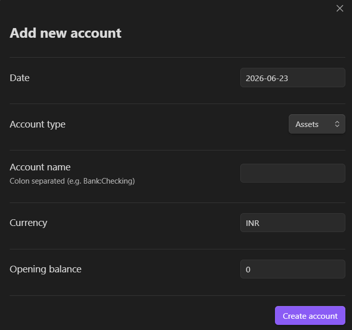
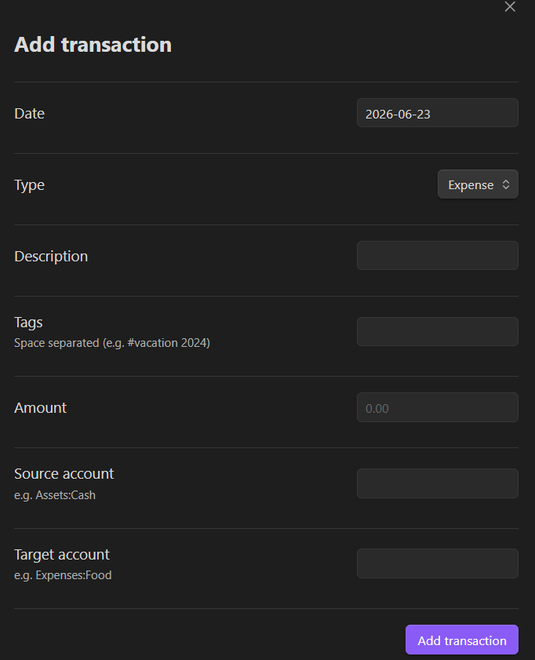
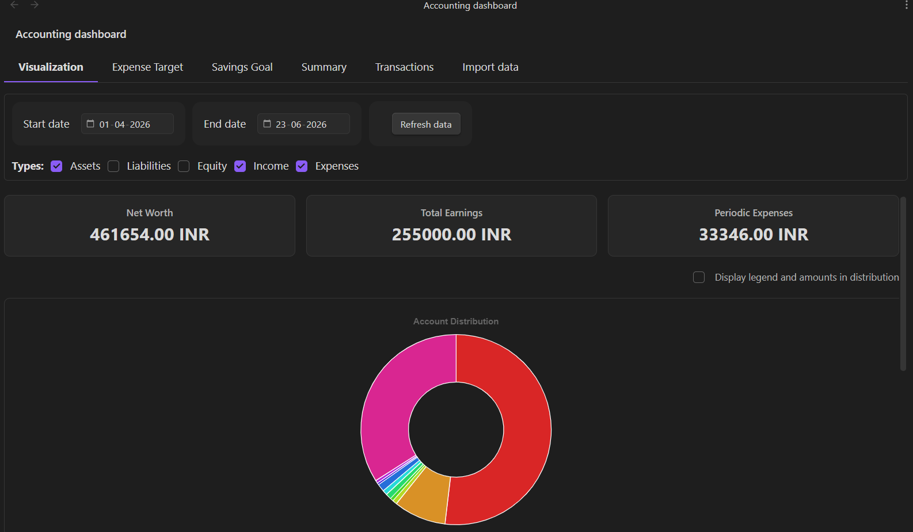
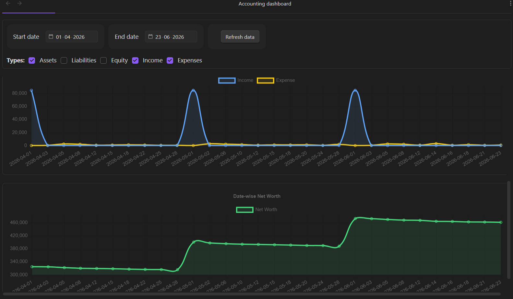
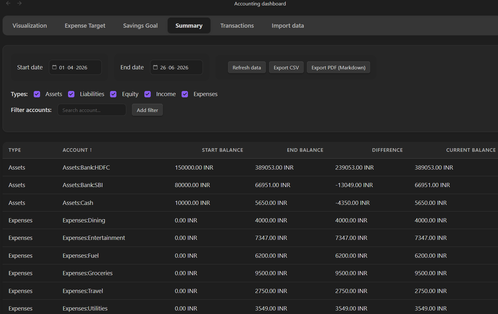
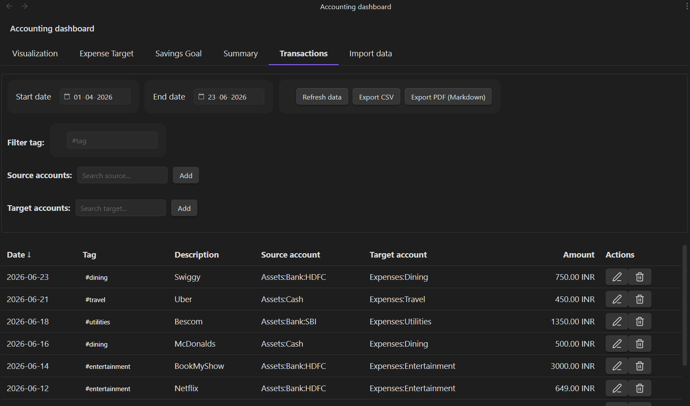
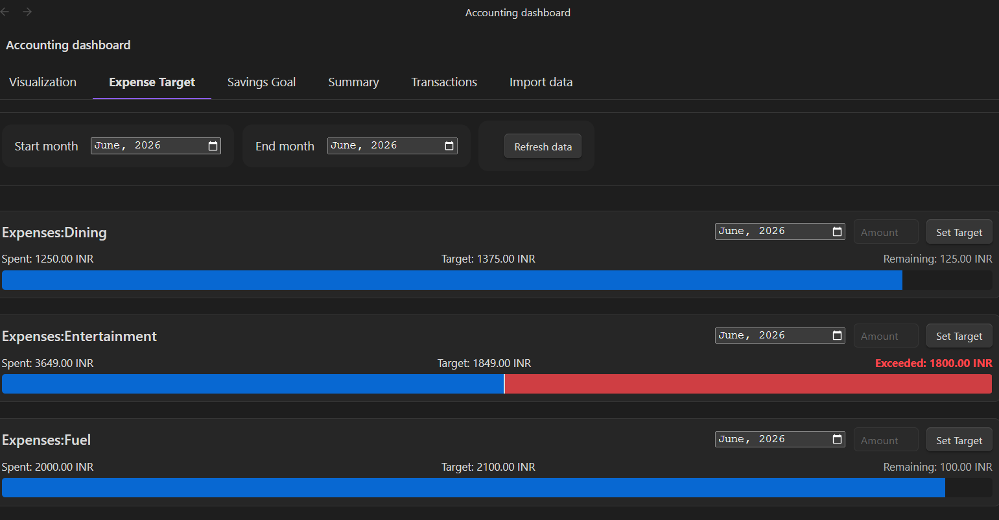
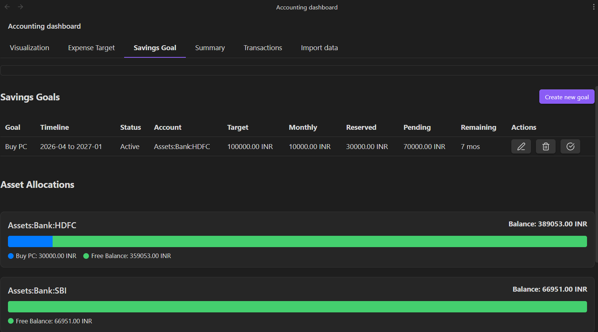
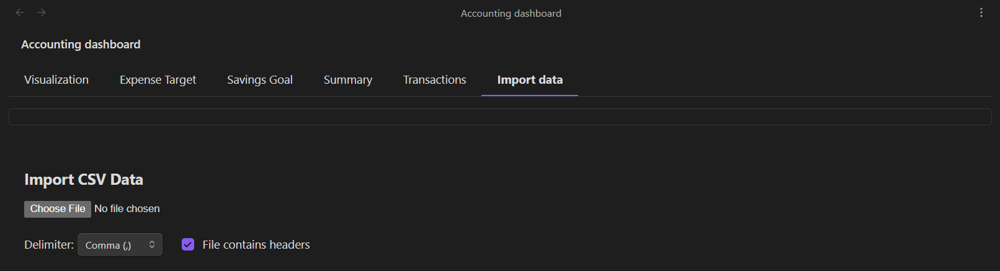

# Obsidian Flat Financing Plugin

Flat Financing turns your Obsidian vault into a powerful, interactive personal finance manager using plain-text Beancount files. 

If you want to track your Net Worth, monitor expenses, and set savings goals without your financial data ever leaving your local vault, this plugin is for you.




















## Features

- 📊 **Interactive Dashboards**: Beautiful, native UI featuring Date-wise Net Worth flows, Cumulative Expenses tracking, Income vs. Expense overlays, and dynamic Account distributions.
- 🎯 **Goals & Limits**: Set monthly expense targets (with bullet charts) and track visual progress bars for your dedicated savings accounts.
- ⚡ **Frictionless Data Entry**: Quickly add, edit, or delete accounts and transactions directly through intuitive modals—no manual syntax typing required. Includes auto-completion and robust constraints.
- 🔍 **Advanced Filtering**: Instantly drill down into your data using wildcard account searches (e.g., `Expenses:Food:*`), specific Tags (`#vacation`), and custom date ranges.
- 📱 **Fully Mobile Optimized**: The UI and data tables are natively built to look and swipe perfectly on the Obsidian mobile app, smartly wrapping controls.
- 🕶️ **Privacy Mode**: One click toggles exact balances to `***` so you can comfortably share your screen or take screenshots.
- 🎨 **Modern, Classy UI**: Comprehensively revamped to feature glassmorphism, depth, segmented control tabs, smooth micro-animations, and a layout that natively respects your active Obsidian theme.
- 📥 **Data Export**: Leverage out-of-the-box download capabilities translating your table configurations instantly into CSV or Markdown PDFs.
- 🔌 **Seamless Integration**: Works entirely locally with your existing `.beancount` text files and updates in real-time.

## Installation

### Method 1: Using BRAT (Recommended for Beta Testing)
1. Install the **[Obsidian42 - BRAT](https://github.com/TfTHacker/obsidian42-brat)** plugin from the Community Plugins in Obsidian.
2. Enable the BRAT plugin.
3. In Obsidian, open the command palette and run `BRAT: Add a beta plugin for testing`.
4. Paste the URL of this GitHub repository.
5. Click **Add Plugin** and wait for BRAT to confirm the installation.
6. Enable the plugin in your Community Plugins settings.

### Method 2: Manual Installation
1.  Clone this repository into your vault's `.obsidian/plugins/` directory.
2.  Run `npm install` to install dependencies.
3.  Run `npm run build` to compile the plugin.
4.  Reload Obsidian and enable the plugin in Community Plugins.

## Usage

### 1. Configuration
Go to **Settings > Obsidian Accounting**:
- **Beancount File Path**: Enter the absolute path to your main `.beancount` file.
- **Currency Symbol**: Set your default currency (e.g., `USD`, `EUR`).
- **Hide Balances**: Globally masks raw Net Worth and explicit Dashboard coordinates tracking natively (rendering values mathematically to strings via `***` or rendering proportional `Percentages` automatically).

### 2. The Dashboard
Open the dashboard via the Ribbon icon (Graph) or the Command Palette (`Accounting: Open Dashboard`).

#### Visualization Tab (Default)
- Graphically chart out native **Account Distribution** density maps natively across explicit filters!
- Toggle legend boundaries pinning exact volume markers. 
- Map robust isolated Timeline tracks spanning **Income vs Expense** flow!

#### Summary Tab
- View start/end balances for all accounts natively mapped.
- Filter by **Account Type** (Assets, Liabilities, etc.) or specific **Account Names**.

#### Transactions Tab
- View a detailed line-item list of transactions.
- **Source Filter**: See where money is coming *from* (e.g., filter `Assets:Bank` to see all payments made from the bank).
- **Target Filter**: See where money is going *to* (e.g., filter `Expenses:Food` to see all food purchases).
- **Tag Filter**: Search for transactions with specific tags like `#reimbursable`.

### 3. Adding Data
- **Add Account**: Use the command `Accounting: Add Account` to open a new account.
- **Add Transaction**: Use the Ribbon icon ("+" symbol) or command `Accounting: Add Transaction`.
    - Supports Description, Amount, Source/Target accounts, and Tags.

## Development

- **Build**: `npm run build`
- **Dev Mode** (Auto-watch): `npm run dev`
- **Unit Tests**:
    This project uses a custom test runner for the Ledger logic.
    ```bash
    npx tsc tests/ledger.test.ts --esModuleInterop --resolveJsonModule --target ES6 --module commonjs
    node tests/ledger.test.js
    ```

## License
MIT

## About
This plugin was entirely generated by **Google Gemini** models (specifically the Antigravity agentic coding assistant) within **Antigravity**.
- **Model**: Google Gemini 
- **Editor**: Antigravity 

