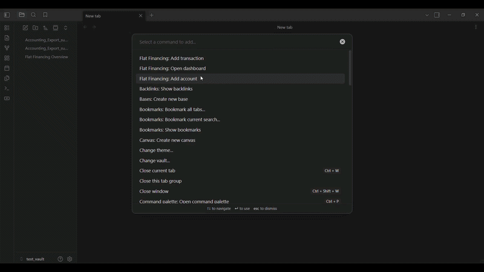

# Obsidian Flat Financing Plugin

A simple [Beancount](https://beancount.github.io/docs/) integration for Obsidian, allowing you to manage your personal finances, track expenses, and view interactive dashboards directly within your vault.



## Features

- **Interactive Dashboard**:
    - **Summary View**: View account balances filtered by Date, Type (Assets, Income, etc.), and specific Accounts.
    - **Transactions View**: List transaction details with powerful filtering.
    - **Tabs**: Easily switch between Summary and Transaction lists.
    - **Multi-column Sorting**: Every table header is intuitively clickable. Easily swap between ascending/descending modes across financial metrics and descriptions.
    - **Sticky Geometries**: Large financial datasets seamlessly drift via custom sticky scroll architectures, freezing header columns and bottom-line totals dynamically inside the frame!
- **Data Export**:
    - **Export CSV / PDF**: Leverage out-of-the-box download capabilities translating your table configurations instantly into universal formats directly connected to native Obsidian capabilities.
- **Advanced Filtering**:
    - Multi-select filters for **Source Accounts** (Credits) and **Target Accounts** (Debits).
    - Filter by **Tags** (e.g., `#vacation`).
    - Standard Date Range filters.
- **Easy Data Entry & Maintenance**:
    - **Add Account**: Create new accounts with opening balances. The engine intelligently prepends new declarations right below your global configuration header instead of crashing at the file-base!
    - **Add Transaction**: Quick entry modal with auto-completion for account names. Supports robust field verification constraints locking zero-value or invalid assignments natively.
    - **Edit Transactions**: Hover over any dashboard record and pop open a direct live modification terminal visually. Changes seamlessly merge straight back into the exact `.beancount` block coordinates perfectly untouched via block splicing!
    - **Auto-Creation**: Automatically initializes new accounts found in transaction entries.
- **Full Mobile Responsive Optimization**:
    - The underlying environment maps complex dynamic variables against Android and iOS footprints! Form controls smartly wrap into broad columns. Native Horizontal view-swiping natively unlocks robust data tables without crushing mobile columns.
    - Custom JS APIs automatically track your live keyboard size on standard inputs, visually sweeping your entire framework straight out of the virtual keyboard overlay seamlessly.
- **Seamless Integration**:
    - Works with your existing `.beancount` text files.
    - Updates in real-time.

## Installation

1.  Clone this repository into your vault's `.obsidian/plugins/` directory.
2.  Run `npm install` to install dependencies.
3.  Run `npm run build` to compile the plugin.
4.  Reload Obsidian and enable **Obsidian Accounting** in Community Plugins.

## Usage

### 1. Configuration
Go to **Settings > Obsidian Accounting**:
- **Beancount File Path**: Enter the absolute path to your main `.beancount` file.
- **Currency Symbol**: Set your default currency (e.g., `USD`, `EUR`).

### 2. The Dashboard
Open the dashboard via the Ribbon icon (Graph) or the Command Palette (`Accounting: Open Dashboard`).

#### Summary Tab
- View start/end balances for all accounts.
- Filter by **Account Type** (Assets, Liabilities, etc.) or specific **Account Names**.

#### Transactions Tab
- View a detailed line-item list of transactions.
- **Source Filter**: See where money is coming *from* (e.g., filter `Assets:Bank` to see all payments made from the bank).
- **Target Filter**: See where money is going *to* (e.g., filter `Expenses:Food` to see all food purchases).
- **Tag Filter**: Search for transactions with specific tags like `#reimbursable`.

### 3. Adding Data
- **Add Account**: Use the command `Accounting: Add Account` to open a new account.
- **Add Transaction**: Use the Ribbon icon ("+" symbol) or command `Accounting: Add Transaction`.
    - Supports Description, Amount, Source/Target accounts, and Tags.

## Development

- **Build**: `npm run build`
- **Dev Mode** (Auto-watch): `npm run dev`
- **Unit Tests**:
    This project uses a custom test runner for the Ledger logic.
    ```bash
    npx tsc tests/ledger.test.ts --esModuleInterop --resolveJsonModule --target ES6 --module commonjs
    node tests/ledger.test.js
    ```

## License
MIT

## About
This plugin was entirely generated by **Google Gemini** models (specifically the Antigravity agentic coding assistant) within **Antigravity**.
- **Model**: Google Gemini 
- **Editor**: Antigravity 

